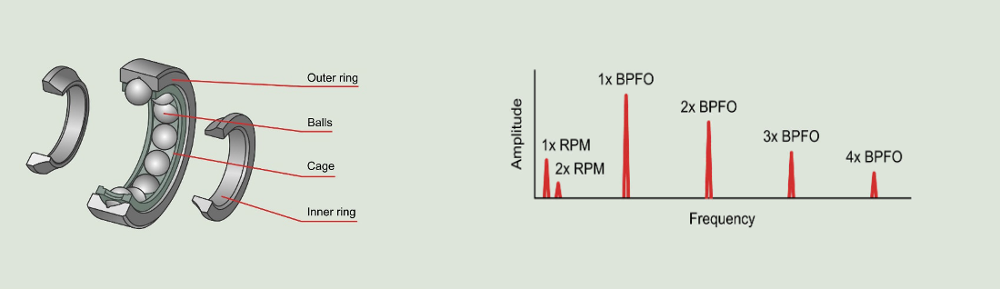
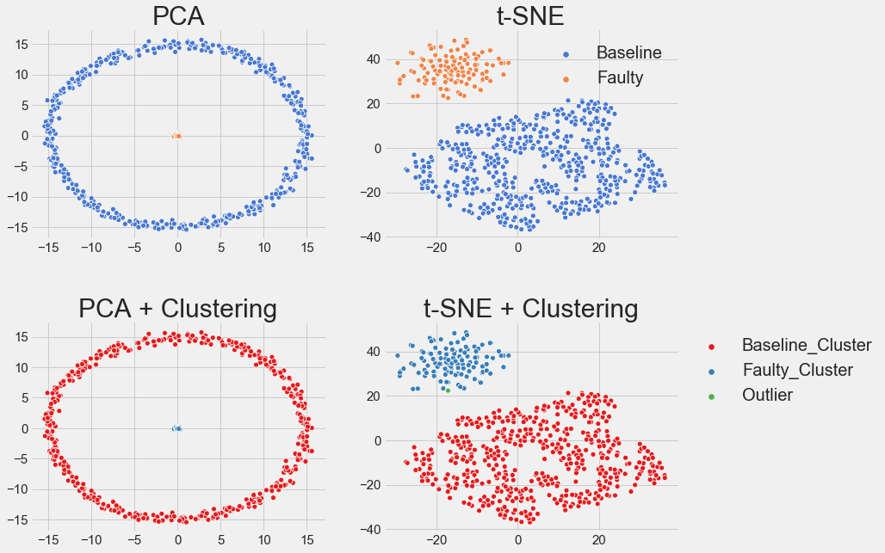
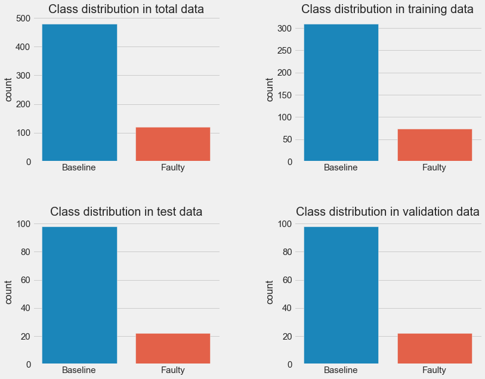
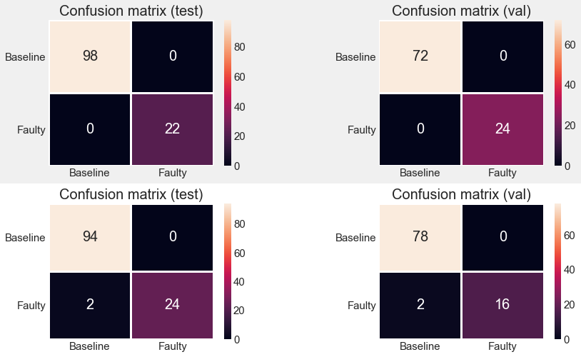

# Conditions Monitoring of Wind Turbines using Machine Learning and Data Analysis 

Ball bearings are a crucial component in any wind turbine. The condition of the ball bearings is monitored to ensure no unexpected downtime of the turbine.

 The ball bearings consists of an outer ring, balls, cage and the inner ring. The ball bearing can be damaged in several ways, where the most common is a dent in either the inner or the outer ring.

Such a dent will cause distinct failure frequencies to appear as a function of the rotation speed of the shaft inside the ball bearing. The **&quot;Ball Pass Frequency Outer&quot;**(BPFO) is the frequencies which the balls passes over a single dent in the outer ring, this is typically specified as a multiple of rotation speed by the manufacturer.
 Every time the ball passes over a dent, it will cause a spike in vibration captured by the data acquisition equipment. This will cause harmonics of the fault frequency(BPFO) to appear in the vibration data as seen in Figure 2. Sometimes these harmonics will also appear at much higher frequencies than seen here, such as and often the low harmonics are not observed.

## Goals

1. Find the difference between a good bearing and a faulty one? Maybe try to identify the BPFO.
2. Use machine learning techniques to distinguish the good bearing from the faulty one.

Renewable energy sources play an increasingly important role in the global energy mix, as the effort to reduce the environmental impact of energy production increases.

Out of all the renewable energy alternatives, wind energy is one of the most developed technologies worldwide. The U.S Department of Energy has put together a guide to achieving operational efficiency using predictive maintenance practices.

Predictive maintenance uses sensor information and analysis methods to measure and predict degradation and future component capability. The idea behind predictive maintenance is that failure patterns are predictable and if component failure can be predicted accurately and the component is replaced before it fails, the costs of operation and maintenance will be much lower.

The sensors fitted across different machines involved in the process of energy generation collect data related to various environmental factors (temperature, humidity, wind speed, etc.) and additional features related to various parts of the wind turbine (gearbox, tower, blades, break, etc.). 

## Objective
“Vestas” is a company working on improving the machinery/processes involved in the production of wind energy using machine learning and has collected data of generator failure of wind turbines using sensors. They have shared a ciphered version of the data, as the data collected through sensors is confidential (the type of data collected varies with companies). Data has 40 predictors, 40000 observations in the training set and 10000 in the test set.

The objective is to build various classification models, tune them and find the best one that will help identify failures so that the generator could be repaired before failing/breaking and the overall maintenance cost of the generators can be brought down. 

“1” in the target variables should be considered as “failure” and “0” will represent “No failure”.

The nature of predictions made by the classification model will translate as follows:

- True positives (TP) are failures correctly predicted by the model.
- False negatives (FN) are real failures in a wind turbine where there is no detection by model. 
- False positives (FP) are detections in a wind turbine where there is no failure. 

So, the maintenance cost associated with the model would be:

**Maintenance cost** = `TP*(Repair cost) + FN*(Replacement cost) + FP*(Inspection cost)`
where,

- `Replacement cost = $40,000`
- `Repair cost = $15,000`
- `Inspection cost = $5,000`

Here the objective is to reduce the maintenance cost so, we want a metric that could reduce the maintenance cost.

- The minimum possible maintenance cost  =  `Actual failures*(Repair cost) = (TP + FN)*(Repair cost)`
- The maintenance cost associated with model = `TP*(Repair cost) + FN*(Replacement cost) + FP*(Inspection cost)`

So, we will try to maximize the ratio of minimum possible maintenance cost and the maintenance cost associated with the model.

The value of this ratio will lie between 0 and 1, the ratio will be 1 only when the maintenance cost associated with the model will be equal to the minimum possible maintenance cost.

## Data Description
- The data provided is a transformed version of original data which was collected using sensors.
- Train.csv - To be used for training and tuning of models. 
- Test.csv - To be used only for testing the performance of the final best model.
- Both the datasets consist of 40 predictor variables and 1 target variable

### Machine Learning

I used the following unsupervised and supervised machine Learning methods for this project : 

*  **Principal Components Analysis**
*  **t-SNE**
*  **Clustering (OPTICS)**
*  **Support Vector Machine (SVM) + Dimensionality Reduction**
*  **XGBoost + FFT** 
*  **Recurrents neural networks**

Careful data preprocessing and dimensionality reduction leads to a perfect score of `100%` accuracy,f1-macro,precision and recal
l with all the methods above. Methods perform reasonably well on the raw data as well with the accuracy of `96.4%` after the K-f
old cross validation.

Careful data preprocessing and dimensionality reduction leads to a perfect score of `100%` accuracy,f1-macro,precision and recal
l with all the methods above. Methods perform reasonably well on the raw data as well with the accuracy of `96.4%` after the K-f
old cross validation.

PCA and t-SNE both successfully reduced the dimensionality of the data and separate baseline and faulty data into different regions, which can be easily clustered.OPTICS nicely predicts faulty and baselines clusters. Also, detects outliers within data (shown in green). 

There is a clear class imbalance in the data. Faulty data is 4 times lower than baseline data.

* **Perfect score in the confusion matrix and both classes are predicted perfectly after dimensionality reduction  and Machine Learning (top).**

* **Not so perfect score in the confusion matrix and faulty class has been as predicted as baseline in 2,2 occasions in both test and validation data respectively after Machine Learning on Raw data. (bottom)**

